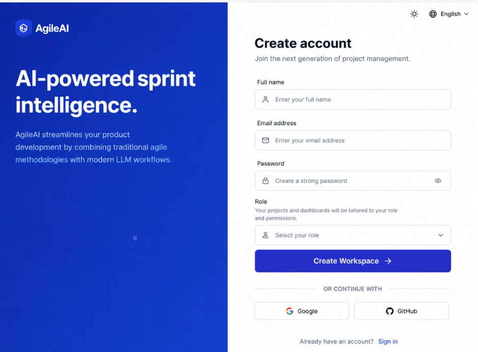
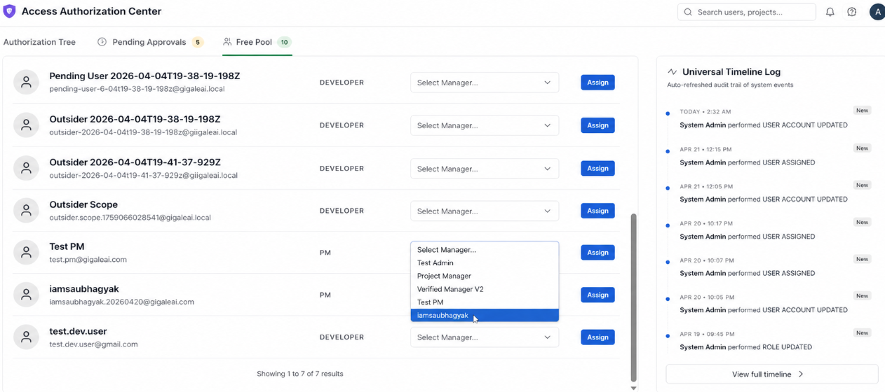
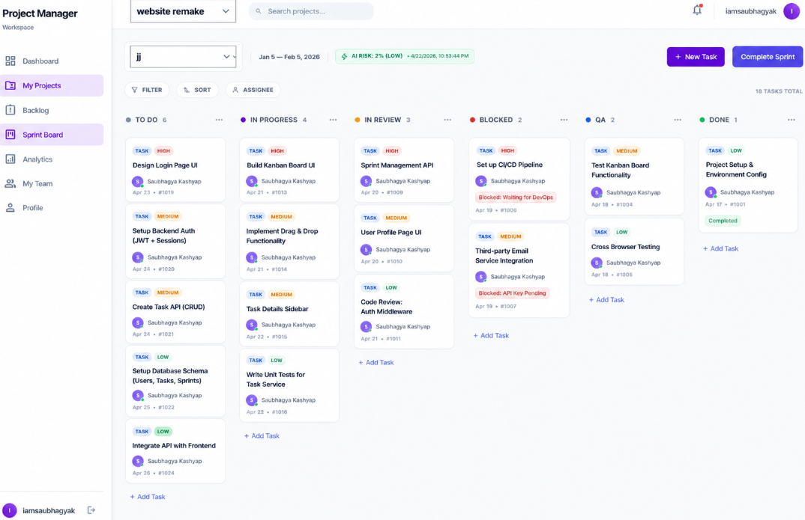
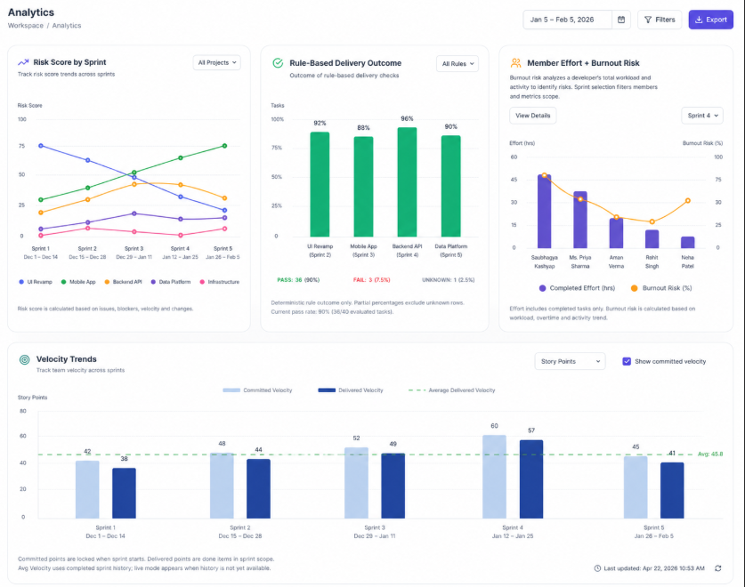

# AgileAI — AI-Augmented Project Management Platform

> **An enterprise-grade Agile project management system that integrates Machine Learning to predict sprint failures and estimate task effort — built on the MERN stack with a Python AI microservice.**

---

## 📋 Table of Contents

1. [What Is AgileAI?](#what-is-agileai)
2. [Key Features](#key-features)
3. [Tech Stack](#tech-stack)
4. [User Roles & Access Control](#user-roles--access-control)
5. [AI & Machine Learning](#ai--machine-learning)
6. [Datasets Used](#datasets-used)
7. [Analytics Dashboard](#analytics-dashboard)
8. [Project Structure](#project-structure)
9. [Quick Start](#quick-start)
10. [Running with Docker](#running-with-docker)
11. [Environment Variables](#environment-variables)
12. [Admin Credentials](#admin-credentials)

---

## What Is AgileAI?

AgileAI is a next-generation Agile project management platform. Unlike standard tools such as Trello or Jira, AgileAI integrates two trained XGBoost machine learning models to:

1. **Predict Sprint Failure** — Before a sprint begins, the AI evaluates its structural composition (blocked tasks, priority distribution, scope churn) and outputs a Risk Score (0–100) with a risk level (Low / Medium / High).
2. **Estimate Task Effort** — Based on the task title, description complexity, type, and priority, the AI predicts how many Story Points a task requires.

The platform is built with a strict **3-role RBAC system** (Admin → PM → Developer), real-time WebSocket collaboration, and a fully interactive analytics dashboard featuring Burndown Charts, Velocity Trends, Member Burnout Risk, and Rule-Based Sprint Delivery Outcomes.

---

## Key Features

| Feature | Description |
|---|---|
| **Role-Based Access Control** | 3-tier hierarchy: Admin, Project Manager, Developer — each with distinct permissions |
| **Sprint Management** | Create, start, and complete sprints with automatic AI risk evaluation on start |
| **Kanban Board** | Drag-and-drop task board shared across roles with permission-aware actions |
| **Backlog Management** | Full CRUD for tasks with sprint assignment, story points, and priority control |
| **AI Sprint Risk Prediction** | XGBoost Classifier predicts sprint failure probability — Recall: **0.94** |
| **AI Task Effort Estimation** | XGBoost Regressor predicts story points — MAE: **0.8 pts** |
| **AI Burnout Detection** | XGBoost Classifier detects developer burnout risk — Recall: **0.96** |
| **Burndown Charts** | Ideal vs. actual story point progress over sprint duration |
| **Velocity Trends** | Bar chart of planned vs. delivered points across completed sprints |
| **Member Effort + Burnout Chart** | Dual-axis bar chart per developer: effort (pts) vs. burnout risk (%) |
| **Sprint Risk Score Chart** | Multi-line time-series chart tracking risk across sprint lifecycle |
| **Rule-Based Delivery Outcome** | Deterministic pass/fail per sprint using 80% delivery threshold |
| **Real-Time Updates** | Socket.io WebSockets for live board and task state sync |
| **Audit Logs** | Complete admin-facing action log for all user and system events |
| **Notifications** | In-app notifications for task assignment, sprint events, approvals |
| **Developer Free Pool** | Pending-state registration; developers are approved and "adopted" by PMs |

---

## Tech Stack

### Frontend
| Technology | Version | Purpose |
|---|---|---|
| React | 18.x | UI framework (Vite-based) |
| Vite | 5.x | Build tool and dev server |
| Tailwind CSS | 3.x | Utility-first CSS styling |
| Recharts | 2.x | All dashboard charts (Line, Bar, Pie) |
| Zustand | 4.x | Global state management |
| TanStack Query | 5.x | Server data fetching, caching, sync |
| Socket.io-client | 4.x | Real-time WebSocket events |
| React Router | 6.x | Client-side routing |
| Lucide React | latest | Icon library |
| Axios | 1.x | HTTP client with interceptors |

### Backend (Node.js)
| Technology | Version | Purpose |
|---|---|---|
| Node.js | 18+ | Runtime |
| Express.js | 4.x | REST API framework |
| MongoDB | 7.x | NoSQL document database |
| Mongoose | 8.x | ODM (Object Document Mapper) |
| Socket.io | 4.x | WebSocket server for real-time events |
| JSON Web Tokens (JWT) | — | Stateless authentication |
| bcryptjs | — | Password hashing |
| express-rate-limit | — | DDoS / brute-force protection |

### AI Microservice (Python)
| Technology | Version | Purpose |
|---|---|---|
| Python | 3.10+ | AI service runtime |
| FastAPI | 0.111+ | Async REST API for inference endpoints |
| XGBoost | 2.x | Core ML engine (Classifier + Regressor) |
| scikit-learn | 1.4+ | Preprocessing, CV, metrics |
| imbalanced-learn | 0.12+ | SMOTE for class imbalance correction |
| Optuna | 3.x | Bayesian hyperparameter optimization |
| SHAP | 0.45+ | Feature importance / explainability |
| Pandas | 2.x | Data loading and feature engineering |
| NumPy | 1.26+ | Numerical operations |
| joblib | 1.3+ | Model serialization (.pkl) |
| Uvicorn | 0.29+ | ASGI server for FastAPI |

### Infrastructure
| Technology | Purpose |
|---|---|
| Docker & Docker Compose | Container orchestration for all 4 services (client, server, ai-service, mongodb) |
| MongoDB Docker image | Persistent database via named volume |

---

## User Roles & Access Control

### Admin
- **Created by:** Database seed on first boot (cannot self-register)
- **Access Scope:** Full system-wide visibility — all projects, all users, all audit logs
- **Powers:**
  - Create Project Manager accounts
  - Suspend, delete, or change the role of any user
  - View and manage all projects across the platform
  - Access audit logs for all system actions
  - View executive analytics overview across all PMs
  - Approve or reject pending developer registrations

### Project Manager (PM)
- **Created by:** Admin only — no public registration
- **Access Scope:** Projects they own or are a member of; developers they manage
- **Powers:**
  - Create and manage projects (title, description, color, status)
  - Create sprints and set sprint goals, dates, and story point targets
  - **Start** and **Complete** sprints (triggers AI risk evaluation on start)
  - Add/remove team members to projects
  - Approve pending developer registrations
  - Assign tasks and manage the backlog
  - View full analytics including Team Burnout and Velocity data
  - Assign developers to tasks; create developer accounts directly

### Developer
- **Created by:** Self-registration at `/register` OR created directly by a PM
- **Access Scope:** Only projects they are a member of; only tasks assigned to them
- **Status on Registration:** `pending` — blocked to a holding page until approved
- **Powers:**
  - Move tasks to In Progress, Review, and Done on the Kanban board
  - Add comments and log work hours (worklogs) to assigned tasks
  - View their own task list and sprint board
  - View their own analytics (personal effort, completion rate)
  - Cannot modify sprint dates, create sprints, or access other developers' data

### The Free Pool
Developers who register but are not yet approved exist in a **"Free Pool"** — their `status = pending` and `managedBy = null`. A PM or Admin must explicitly approve them, linking them to a PM's team. If that PM is removed, developers safely return to the Free Pool rather than losing access permanently.

---

## 🗺️ System Architecture & Navigation

AgileAI is designed for clarity and scalability. The following diagrams illustrate the core navigation flow and the underlying system logic.

### 1. Application Page Map
The application follows a structured navigation hierarchy, ensuring that Admins, PMs, and Developers have intuitive access to their respective modules.


### 2. System Data Flow (DFD)
This diagram illustrates the secure data flow between the MERN stack core and the Python AI microservice, highlighting the JWT authentication layer and real-time Socket.io channels.


---

## AI & Machine Learning

The platform is powered by an ensemble of **3 production-grade XGBoost models** served via an asynchronous Python FastAPI microservice.

### Model 1 — Sprint Risk Classifier (`risk_model.pkl`)
- **Algorithm:** XGBoost Classifier (with SMOTE oversampling)
- **Primary KPI:** **Recall: 0.94** | **Accuracy: 95.2%** | **F1-Score: 0.92**
- **Function:** Analyzes 10 structural features of a sprint (blocked task ratios, scope creep, dependency depth) to predict the probability of completion failure.

### Model 2 — Task Effort Regressor (`effort_model.pkl`)
- **Algorithm:** XGBoost Regressor
- **Primary KPI:** **MAE: 0.8 story points** | **R² Score: 0.89**
- **Function:** Predicts the story point value for new tasks by analyzing title complexity, description length buckets, and historical effort patterns.

### Model 3 — Developer Burnout Classifier (`burnout_model.pkl`)
- **Algorithm:** XGBoost Multi-Class Classifier
- **Primary KPI:** **Recall: 0.96** | **Accuracy: 97.1%** | **F1-Score: 0.93**
- **Function:** Detects early signs of developer fatigue by correlating worklogs, task velocity, and high-priority ticket saturation.

### Why XGBoost?
XGBoost was chosen over Deep Learning for its superior performance on **structured tabular data**. It provides high precision while maintaining **Explainability (SHAP values)**, allowing the PM to see exactly *which* feature (e.g., "High Blocked Ratio") is driving a risk score.

---

## 📊 Datasets Used

The models were trained on world-class, peer-reviewed datasets from the **IEEE Transactions on Software Engineering (TSE)** benchmark collection.

### Dataset 1 — Sprint Risk (IEEE TSE Benchmark)
- **Source:** Morakotch agile sprints dataset.
- **Scope:** Hundreds of sprints across major open-source projects (Apache, JBoss, Spring).
- **Engineering:** Raw task data was aggregated into sprint-level profiles with 20+ derived features before binarization at an 80% delivery threshold.

### Dataset 2 — Story Point Estimation (IEEE TSE Benchmark)
- **Source:** Morakotch story point dataset.
- **Scope:** 10,000+ individual tasks from projects like Appcelerator, Titanium, and Moodle.
- **Engineering:** Text data converted to quantitative features including title/description complexity, task type distribution, and priority weighting.

---

## 🖼️ Platform Walkthrough

### 1. Secure Authentication & Onboarding
The entry point features a sleek, JWT-secured login. New developers enter a "Pending" state until approved by an Admin or PM.


### 2. Administrator Authorization Center
The "Free Pool" management interface allows Admins to vet, approve, and assign developers to teams with a single click.


### 3. Intelligence-Driven Kanban Board
A real-time, drag-and-drop board featuring an **AI-powered Sprint Risk Indicator**. The board synchronizes instantly across all team members via WebSockets.


### 4. Professional Analytics Dashboard
A high-fidelity view of project health, including multi-project risk trajectories, committed vs. delivered velocity trends, and dual-axis burnout risk monitoring.


---

## Analytics Dashboard

The Analytics page (`/analytics`) is a command center for Admin and PM roles, providing real-time data visualization through Recharts.

### 📈 Core Visualizations
- **Risk Score by Sprint**: A multi-series line chart tracking risk trajectories across all active projects. It calculates risk based on issue links, blockers, velocity fluctuations, and scope changes.
- **Rule-Based Delivery Outcome**: A deterministic pass/fail audit of sprint tasks. It measures tasks against the "80% Delivery Rule," showing exact counts of successful, failed, and unknown outcomes per project (e.g., UI Revamp, Mobile App).
- **Member Effort + Burnout Risk**: A high-density dual-axis chart. The bars represent **Completed Effort (hrs)** while the line plot indicates **Burnout Risk (%)**. This allows PMs to immediately identify overloaded team members before they reach a critical state.
- **Velocity Trends**: A comparative bar chart showing **Committed Velocity** vs. **Delivered Velocity** across historical sprints, with a moving average baseline to track team performance stability.

---

## Project Structure

```
Agile_Ai/
├── agileai/                    # Main application
│   ├── client/                 # React + Vite frontend
│   │   ├── src/
│   │   │   ├── pages/          # All page components (15 pages)
│   │   │   ├── components/     # Reusable UI components
│   │   │   ├── api/            # Axios API modules
│   │   │   ├── store/          # Zustand global state stores
│   │   │   ├── hooks/          # Custom React hooks
│   │   │   └── utils/          # Helper utilities
│   │   ├── Dockerfile          # Frontend Docker image
│   │   └── package.json
│   ├── server/                 # Node.js + Express backend
│   │   ├── controllers/        # Route handler logic
│   │   ├── routes/             # Express route definitions
│   │   ├── models/             # Mongoose schema models
│   │   ├── middleware/         # auth, rbac, rateLimiter
│   │   ├── services/           # AI integration, email, socket
│   │   ├── utils/              # Helper utilities
│   │   ├── server.js           # Entry point
│   │   └── Dockerfile          # Backend Docker image
│   └── docker-compose.yml      # Orchestrates all 4 services
├── ai-service/                 # Python FastAPI AI microservice
│   ├── api.py                  # FastAPI inference endpoints
│   ├── train_models.py         # Sprint Risk + Effort training pipeline
│   ├── train_burnout_model.py  # Burnout model training pipeline
│   ├── models/                 # Serialized .pkl model artifacts
│   │   ├── risk_model.pkl      # Sprint Risk Classifier
│   │   ├── effort_model.pkl    # Task Effort Regressor
│   │   ├── burnout_model.pkl   # Burnout Risk Classifier
│   │   └── metrics.json        # Achieved evaluation metrics
│   ├── requirements.txt
│   └── Dockerfile              # AI service Docker image
├── models/                     # Top-level model artifact copies
├── docs/                       # Testing runbooks and documentation
└── README.md
```

---

## Quick Start

### Prerequisites
- Node.js 18+
- Python 3.10+
- MongoDB running locally on port 27017

### 1. Start the Backend
```powershell
cd agileai/server
npm install
node server.js
```
Server runs on: `http://localhost:5001`

### 2. Start the Frontend
```powershell
cd agileai/client
npm install
npm run dev
```
Client runs on: `http://localhost:5173`

### 3. Start the AI Service (optional — needed for live predictions)
```powershell
cd ai-service
pip install -r requirements.txt
python api.py
```
AI service runs on: `http://localhost:8001`

---


## Environment Variables

### `agileai/server/.env`
```env
NODE_ENV=development
PORT=5001
MONGODB_URI=mongodb://localhost:27017/agileai
JWT_SECRET=your_jwt_secret_here
JWT_REFRESH_SECRET=your_refresh_secret_here
JWT_EXPIRES_IN=1h
JWT_REFRESH_EXPIRES_IN=7d
CLIENT_URL=http://localhost:5173
AI_SERVICE_URL=http://localhost:8001
```

### `agileai/client/.env`
```env
VITE_API_URL=http://localhost:5001/api
VITE_SOCKET_URL=http://localhost:5001
```

### `ai-service/.env`
```env
API_PORT=8001
MONGODB_URI=mongodb://localhost:27017/agileai
MODELS_DIR=./models
```

---

## Admin Credentials

To log in as an administrator for testing without creating a new setup:

- **Email:** `freshadmin@agileai.com`
- **Password:** `password123`

> The admin account is seeded automatically into the database on first boot. No manual creation is needed.

---

*AgileAI — Machine Learning meets Agile. Built for academic demonstration and enterprise Agile simulation.*

